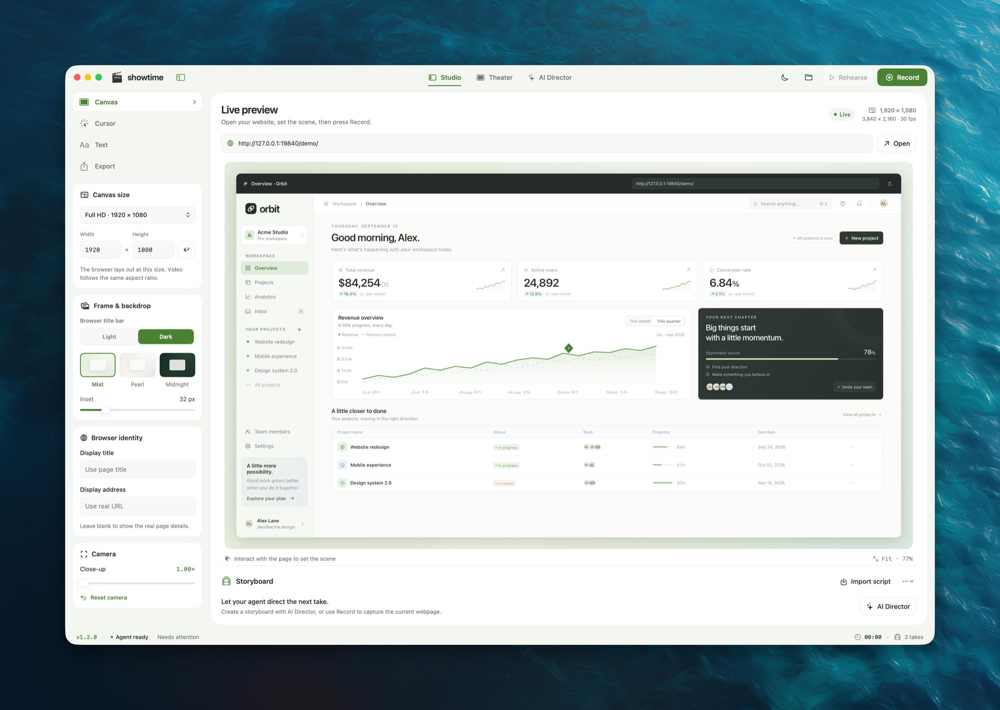

<p align="center">
  
</p>
<h1 align="center">Showtime</h1>
<p align="center"><strong>原生 macOS 演示浏览器，让 Agent 编排网页交互并录制产品演示。</strong><br>操作真实网页 · 编排镜头与光标 · 导出 MP4</p>
<p align="center"><a href="docs/README.en.md">English</a></p>
<p align="center">
  
  
  
  <a href="https://github.com/nocoo/showtime/actions/workflows/ci.yml"></a>
  <a href="LICENSE"></a>
</p>

<p align="center">
  
</p>

---

## 这是什么

Showtime 把真实网页、鼠标操作、镜头运动和动态文字编排成可重复执行的产品演示。你可以在原生 macOS 工作台里操作，也可以让 Agent 通过 CLI 或 MCP 检查页面、执行交互，再将合成画面录制为 MP4。

网页在 WebKit 中运行，录制画面包含浏览器外框、背景、演示光标和文字。项目内置可交互的 Orbit 示例网站和完整演示剧本，当前导出不包含音轨。

## 功能

- **真实网页交互** — 打开线上或本地开发页面，用 CSS 选择器或坐标移动、点击、双击、拖拽、滚动和输入；等待元素出现，并检查页面状态。
- **镜头与画面** — 编排镜头缩放、移动和动态标题，组合并行动作；选择背景、调整画布留白，并单独设置画面中的浏览器标题与地址。Canvas 支持最高 4K（3840 × 2160）预设及自定义尺寸。
- **设备框架** — 默认 None；支持 iPhone 16 Pro／Pro Max、iPad Pro 11／13 英寸，以及按 2026 款外观重绘的 MacBook Neo 和 MacBook Pro。Light 为银色；Dark 在 Neo 上为靛蓝色，其余设备为深空黑。Content width 可独立指定屏幕宽度，设备按比例居中，留白自动计算；默认 Auto 保留自动适配。按 Export 分辨率采样网页并绘制外框，支持高清 4K 输出。
- **演示光标** — 使用 macOS 箭头与手型、圆环、圆点、聚光灯或自定义 PNG，调整大小、颜色、热点和点击效果。
- **可重复剧本** — 用 JSON 保存动作顺序，先排练，再录制。任务返回进度和每一步的结果，支持异步执行与中途停止。
- **录制与截图** — 导出 H.264 MP4 或合成画面的 PNG；支持 24、30、60 fps，默认 1920 × 1080 / 30 fps。中止录制会保存可播放的已录部分。
- **Agent 接入** — Python CLI 和 MCP stdio 服务共用本机控制接口，无第三方 Python 依赖。Agent 可先检查元素，再用选择器执行操作。

## 安装

从 [GitHub Releases](https://github.com/nocoo/showtime/releases/latest) 下载通用 DMG，打开后将 `Showtime.app` 拖入 Applications；也提供 ZIP 压缩包。支持 macOS 14+ 的 Apple Silicon 与 Intel Mac，运行界面无需 Xcode 或源码。

当前版本使用 ad-hoc 签名，尚未经过 Apple 公证。首次打开如被 macOS 拦截，尝试打开 App 后，在「系统设置 → 隐私与安全 → 仍要打开」确认；也可以在终端执行：

```sh
xattr -dr com.apple.quarantine "/Applications/Showtime.app"
open "/Applications/Showtime.app"
```

安装位置不同时替换路径；如果提示权限不足，在 `xattr` 前加 `sudo`。命令只移除这个 App 的下载隔离标记，Apple 公证状态不变。

每次启动默认打开内置 Orbit 示例，用户或 Agent 可以随后打开自己的网页。网页浏览与录制无需额外工具；CLI / MCP 需要 Python 3.10+。

按需进入 **AI Director → Agent integration → Install tools**，安装随 App 附带的 CLI 和 MCP bridge。工具放在 `~/Library/Application Support/Showtime/bin`，无需源码或管理员权限。页面会检查 Python；缺少时可点击 **Download Python**，安装后点击 **Check Python**。普通启动和复制简报都不会安装工具，也不会弹出开发工具安装窗口。

安装完成后可复制整份导演指令、MCP 配置或 CLI 命令。在每个新的终端会话执行一次：

```sh
export PATH="$HOME/Library/Application Support/Showtime/bin:$PATH"
showtime status
showtime studio --mode theater
```

这只设置当前终端的 PATH。App 移动或重命名后连接入口保持不变；升级 App 后若提示 **Update available**，在同一页面点击 **Update tools**。工具和连接配置不依赖 App 的安装位置，也不包含开发者目录。已有可用 MCP 连接时，可以直接复制简报使用。

也可以从源码构建，需要 Swift 6 / Xcode Command Line Tools 和 Python 3.10+。未安装开发工具时，先运行 `xcode-select --install`；签名设置见 [macOS 签名](docs/signing.md)。

```sh
git clone https://github.com/nocoo/showtime.git
cd showtime
scripts/run.sh
```

运行脚本会构建并打开 `dist/Showtime.app`。使用 CLI 或 MCP 时保持应用运行。完成上面的终端设置后，先用内置 Orbit 剧本排练，再导出第一段演示：

```sh
showtime demo --rehearse
showtime demo --output ~/Movies/Showtime/orbit-launch.mp4
```

每次导出使用新的文件路径，已有文件不会被覆盖。录制分辨率与画布必须保持相同宽高比。

## 命令一览

完成上面的终端设置后，以下命令可以在任意目录运行；`showtime --help` 查看完整帮助。源码开发者也可以在仓库根目录使用 `scripts/showtime`。

| 命令 | 说明 |
| --- | --- |
| `showtime status` | 查看页面、镜头、光标、录制与任务状态 |
| `showtime open http://localhost:3000` | 打开页面；也支持线上 URL 与 `showtime://demo` |
| `showtime settings --frame iphone-16-pro` | 切换设备框架和真实视口；`--frame none` 恢复浏览器 |
| `showtime settings --content-width 1200` | 固定屏幕内容宽度并居中；`--content-width auto` 恢复自动适配 |
| `showtime inspect` | 获取可见交互元素的选择器、文字和坐标 |
| `showtime act '{"action":"click","selector":"#new-project"}'` | 执行单个动作；此例适用于内置 Orbit 页面 |
| `showtime run film.json --rehearse` | 排练自定义剧本，见下方示例 |
| `showtime run film.json --output ~/Movies/Showtime/film.mp4` | 执行剧本并录制；加 `--no-wait` 可立即取得任务 ID |
| `showtime job JOB_ID` / `showtime wait JOB_ID` | 查询进度或等待完成 |
| `showtime record start --output ~/Movies/Showtime/take.mp4` | 开始手动或逐步 API 录制；用 `record stop` 完成 |
| `showtime screenshot ~/Movies/Showtime/frame.png` | 保存包含设备框架、镜头、光标和文字的合成画面 |
| `showtime stop` | 停止当前任务，并收尾保存已录内容 |
| `showtime mcp-config` | 输出可直接用于 MCP 客户端的配置 |
| `showtime mcp` | 启动 MCP stdio bridge，由 MCP 客户端调用 |

### 连接 Agent

运行 `showtime mcp-config`，将输出合并到支持 MCP stdio 的客户端配置中，也可以在 AI Director → Connection details 一键复制。配置通过用户目录中的固定入口启动，自动展开当前用户的 HOME；不包含开发目录、临时下载路径或会话凭据。

MCP 提供 `showtime_status`、`showtime_settings`、`showtime_studio`、`showtime_inspect`、`showtime_open`、`showtime_act`、`showtime_run`、`showtime_job`、`showtime_record` 和 `showtime_screenshot`。典型流程是检查页面元素、规划剧本、排练、验证结果，再录制。

### 编写剧本

将下面的内容保存为 `film.json`，再使用上面的 `run` 命令：

```json
{
  "version": 1,
  "name": "First take",
  "steps": [
    { "action": "open", "url": "showtime://demo" },
    { "action": "waitFor", "selector": "#new-project" },
    { "action": "move", "selector": "#new-project", "duration": 0.8 },
    { "action": "click", "selector": "#new-project" },
    { "action": "wait", "duration": 1.5 }
  ]
}
```

`caption` 不会暂停后续动作，需要展示时长时另加 `wait`。完整示例见[本地产品剧本](examples/local-product.json)、[光标样式](examples/cursor-styles.json)和 [Orbit 演示](Sources/Showtime/Resources/Scripts/orbit-launch.json)。

## 项目结构

```text
Sources/
├── Showtime/               # 原生工作台、浏览器、导演与录制
│   └── Resources/          # Orbit 网站与内置剧本
└── ShowtimeCore/           # 剧本模型、校验与 HTTP 协议
scripts/                    # 构建、CLI、MCP 与验证工具
examples/                   # 自定义剧本与光标示例
Tests/ShowtimeCoreTests/     # 独立 Swift 检查程序
docs/                       # 英文 README 与版本管理
```

## 技术栈

| 层 | 技术 |
| --- | --- |
| 原生界面与输入 | [SwiftUI](https://developer.apple.com/xcode/swiftui/)、[AppKit](https://developer.apple.com/documentation/appkit) |
| 真实网页 | [WebKit](https://webkit.org/) |
| 视频合成与导出 | [AVFoundation](https://developer.apple.com/av-foundation/) |
| 脚本与应用构建 | [Swift](https://www.swift.org/)、[Swift Package Manager](https://www.swift.org/documentation/package-manager/) |
| Agent 接口 | [Python](https://www.python.org/) 标准库、[MCP](https://modelcontextprotocol.io/)、本机 HTTP |

## 开发

Swift Package Manager 管理构建；根目录 `package.json` 仅保存版本和快捷命令，无需安装 Node 依赖。除安装环境外，运行测试还需要 Node.js，用于内置网站 JavaScript 的语法检查。

| 命令 | 用途 |
| --- | --- |
| `scripts/run.sh` | 构建 Debug 应用并打开工作台 |
| `scripts/build.sh release` | 构建 Release 应用到 `dist/Showtime.app` |
| `scripts/test.sh` | 检查版本、核心行为以及 Python / JavaScript 语法 |
| `python3 scripts/version.py check` | 检查版本文件是否一致 |

## 测试

| 层 | 内容 | 运行方式 |
| --- | --- | --- |
| 核心检查 | 剧本模型、动作校验和 HTTP 协议 | `scripts/test.sh`，CI 自动执行 |
| 构建与语法 | 原生应用构建、Python 和内置网站 JavaScript | macOS CI |
| 原生集成 | 网页输入、光标、缩放、鉴权、任务冲突和中止后的 MP4 | 在已登录的 macOS 桌面手动执行 |

原生集成检查需要已打开的 Showtime，且没有进行中的录制或排练；检查会操作内置演示页面：

```sh
python3 scripts/test_integration.py
```

## 文档

| 文档 | 内容 |
| --- | --- |
| [English README](docs/README.en.md) | 英文使用说明 |
| [剧本示例](examples/) | 本地产品演示与光标配置 |
| [版本管理](docs/versioning.md) | 版本来源、同步和发布命令 |
| [变更记录](CHANGELOG.md) | 各版本改动 |
| [GitHub Releases](https://github.com/nocoo/showtime/releases) | 已发布版本 |
| [Hexly 项目页](https://hexly.ai/logos/showtime) | 项目介绍与图标 |

## License

[MIT](LICENSE) © 2026 NOCOO
